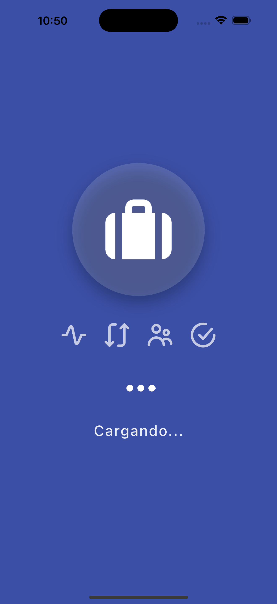
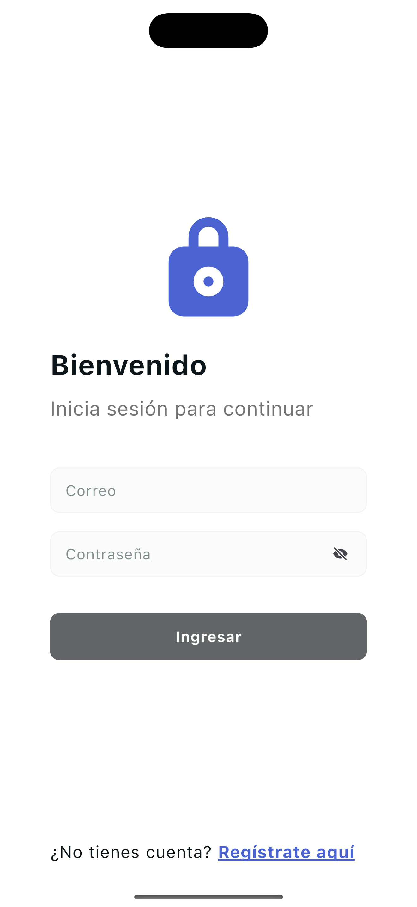
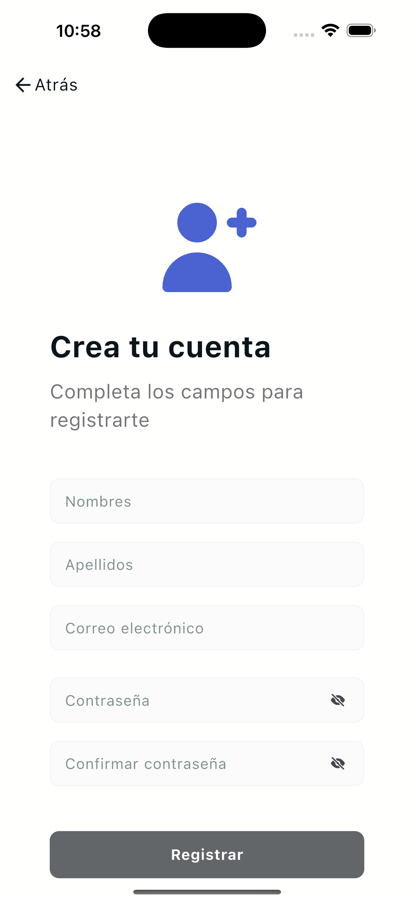
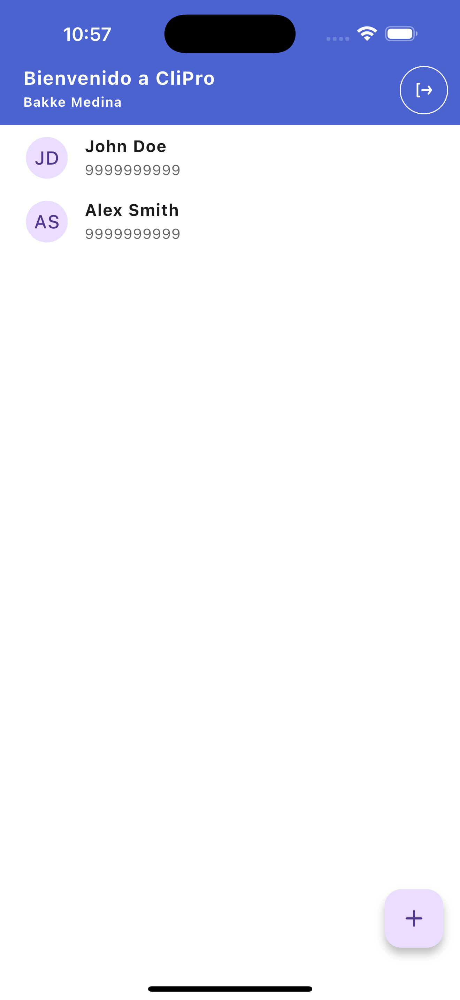
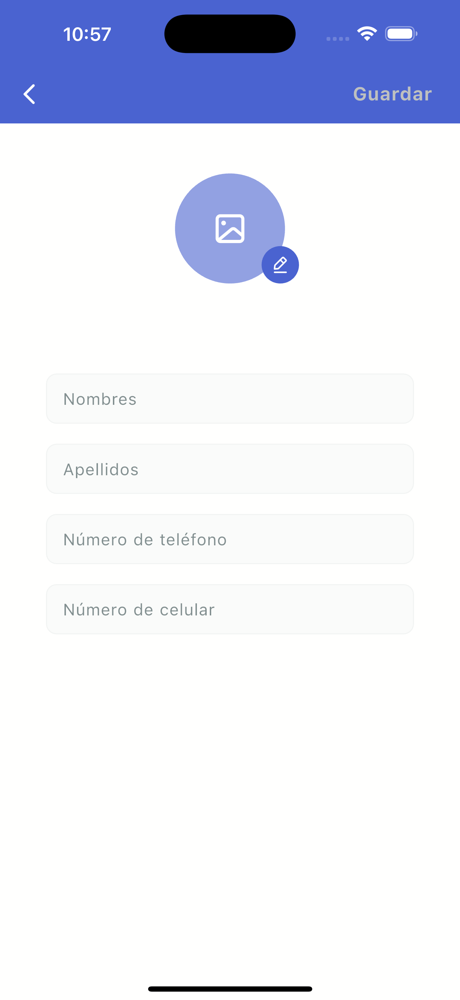
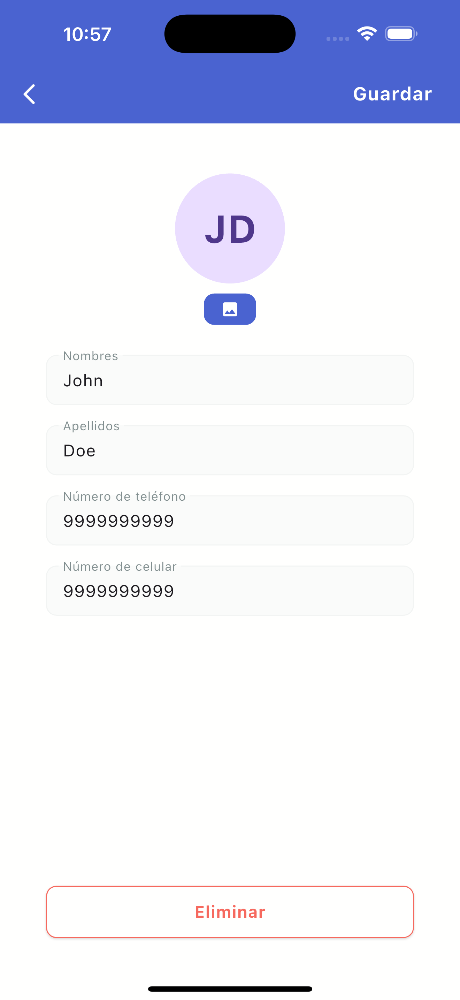

# CliPro App

Esta aplicación ha sido desarrollada como parte de una prueba técnica, con el objetivo de demostrar habilidades prácticas, buenas prácticas de desarrollo y capacidad para resolver requerimientos específicos.

## Descripción

CliPro App es una aplicación móvil desarrollada en Flutter que permite el registro de usuarios y por su mantención

## Instalación

### Prerrequisitos

- Tener instalado Flutter en tu sistema. Puedes encontrar instrucciones de instalación [aquí](https://flutter.dev/docs/get-started/install).

- El archivo .env puede usar el .env.example para tener una idea de como se lo puede crear y llenar los campos:

    ```bash
    # EXAMPLE
    SUPABASE_URL="YOUR_SUPABASE_URL"
    SUPABASE_ANON_KEY="YOUR_SUPABASE_ANON_KEY"
    ```


### Pasos de Instalación

1. Clona este repositorio en tu máquina local usando Git:

    ```bash
    git clone https://github.com/bakamedi/client_management.git
    ```

2. Instala las dependencias del proyecto usando Flutter:

    ```bash
    flutter pub get
    ```

3. Luego ejecutar el siguiente comando para generar los modelos:

    ```bash
    flutter pub run build_runner watch --delete-conflicting-outputs
    ```

4. Con eso ya se podra ejecutar el proyecto

    ```bash
    flutter run
    ```

## Estructura del Proyecto

Este proyecto está organizado en las siguientes carpetas y archivos:

## Descripción de Carpetas

### core

- **adaptative_screen**: Implementaciones para pantallas adaptativas.
- **environment**: Configuraciones y variables de entorno.
- **theme**: Configuraciones y estilos de tema.
- **utils**: Utilidades generales para uso en toda la aplicación.

### data

- **data_source**: Fuentes de datos, como API, bases de datos, etc.
- **helpers**: Ayudantes y utilidades relacionadas con datos.
- **repositories_impl**: Implementaciones de repositorios.

### domain

- **models**: Modelos de datos.
- **repositories**: Interfaces de repositorios.

### presentation

- **global**
  - **controllers**: Controladores globales.
  - **utils**: Utilidades para la presentación global.
  - **widgets**: Componentes visuales reutilizables.
  - **extensions**: Extensiones útiles para la aplicación.
- **modules**
  - **controller**: Controladores específicos del módulo.
  - **utils**: Utilidades de funciones específicas del módulo.
  - **view**: Vistas específicas del módulo .

### routes

- Configuraciones de rutas de la aplicación.

### Otros Archivos

- **injection_providers.dart**: Proveedores de inyección de dependencias.
- **my_app.dart**: Archivo principal de configuración de la aplicación.
- **main.dart**: Punto de entrada de la aplicación.

# App Images

## iOS

<div style="display: flex; flex-wrap: wrap; gap: 10px;">
  
  
  
  
  
  
</div>
